# Food4Good

### We collaborate with supermarkets and grocery stores by providing a way to preserve expiring soon items and make a positive social impact by donating it for needy people.
Video demo: <a href="docs/food_for_good.mp4">click here</a> 

Presentation:
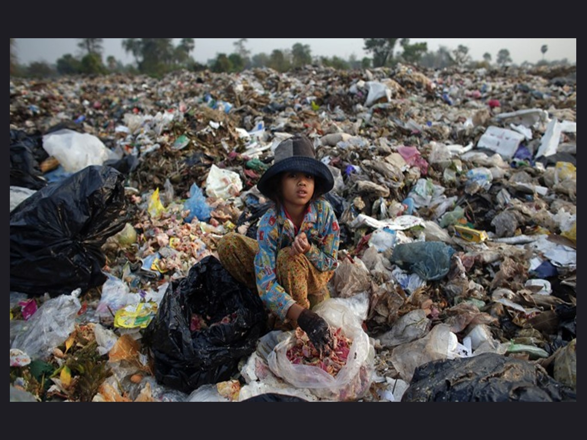
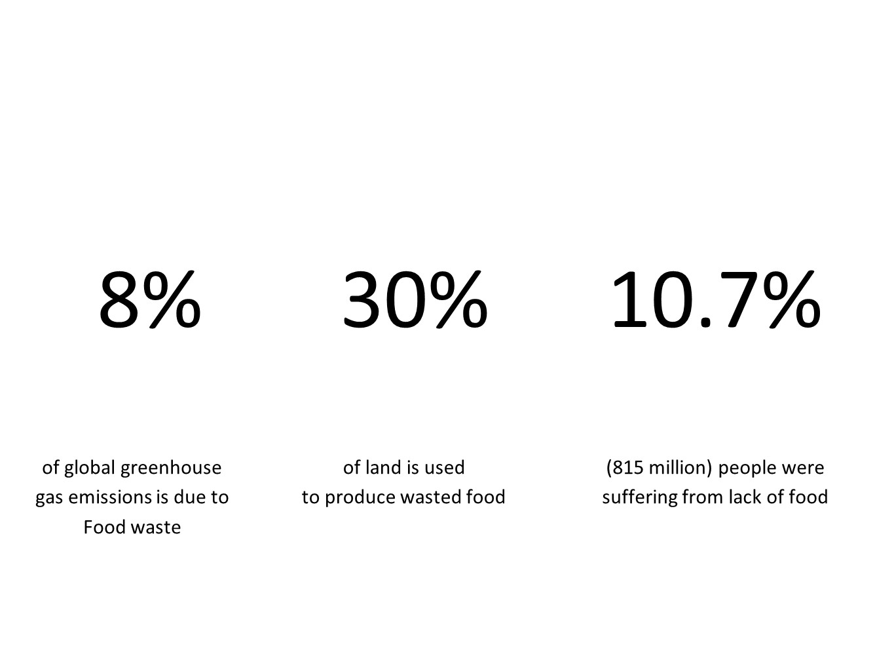
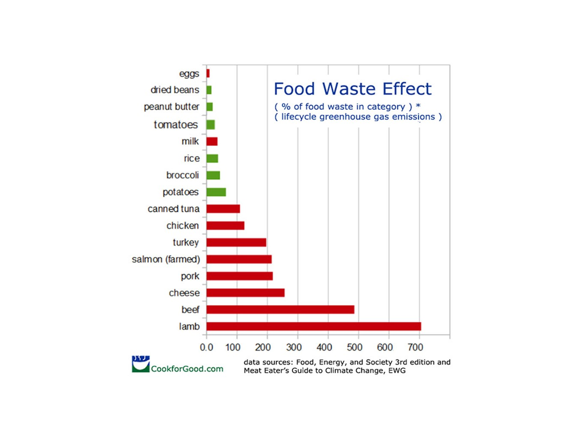
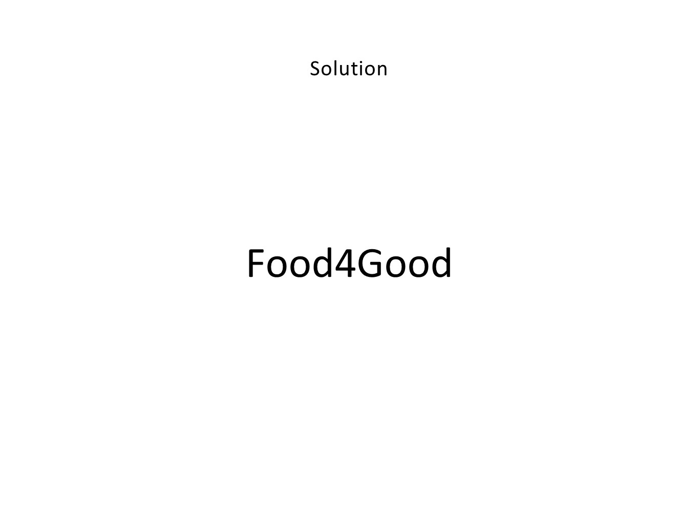
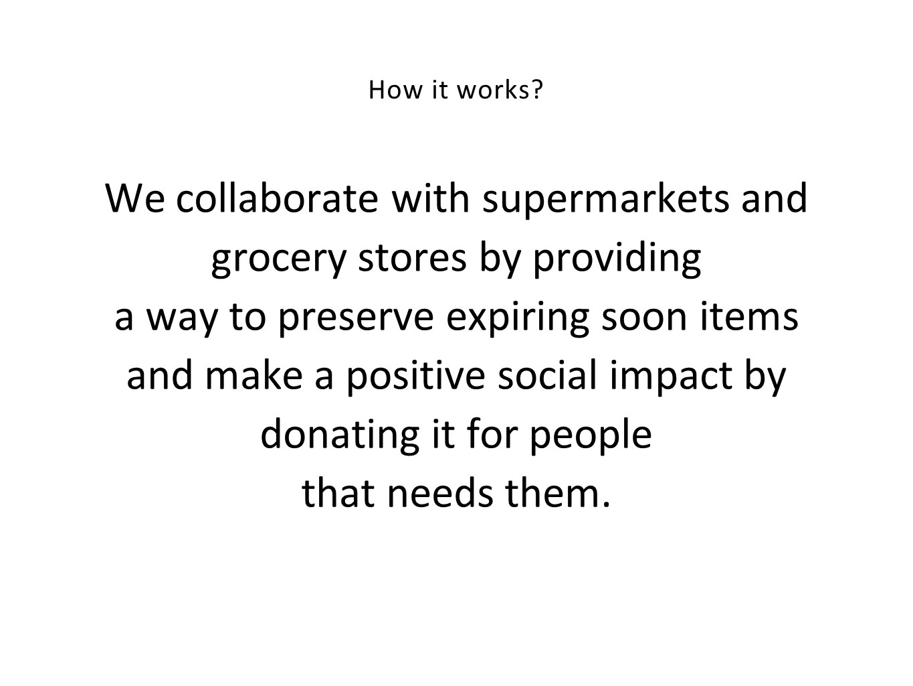
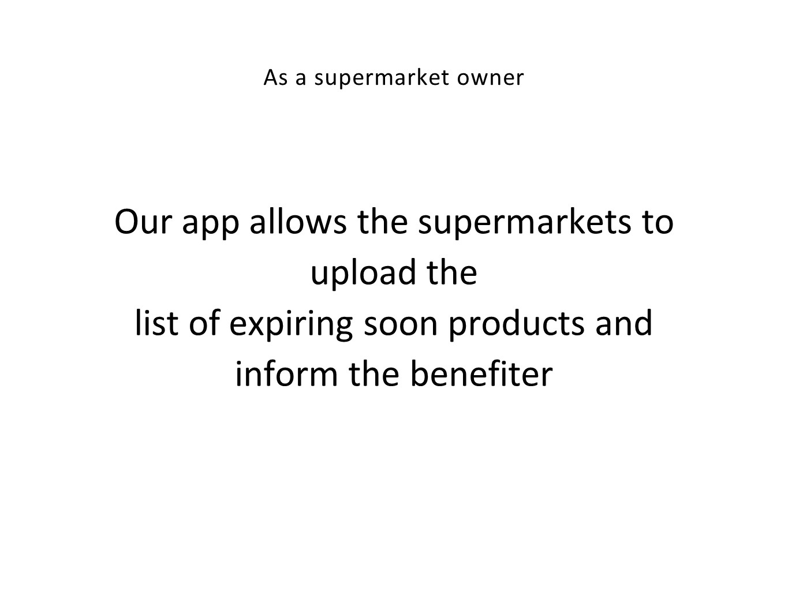
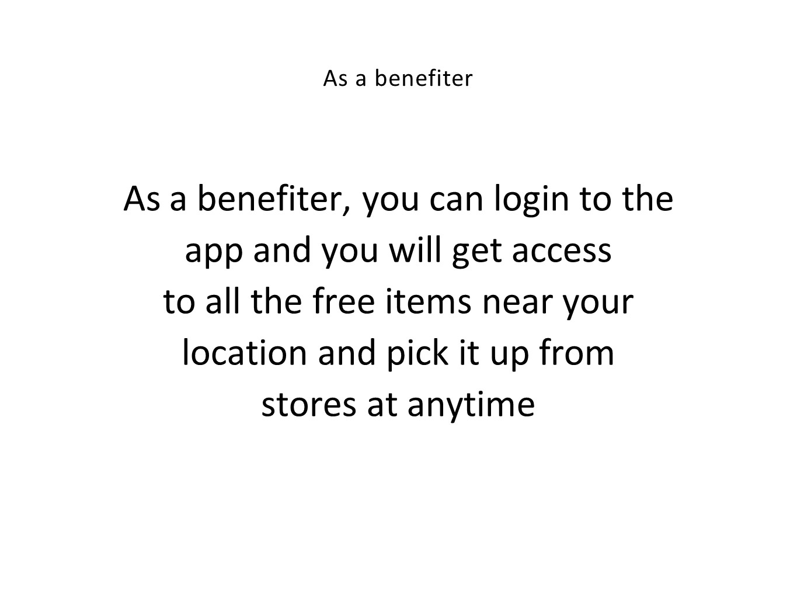
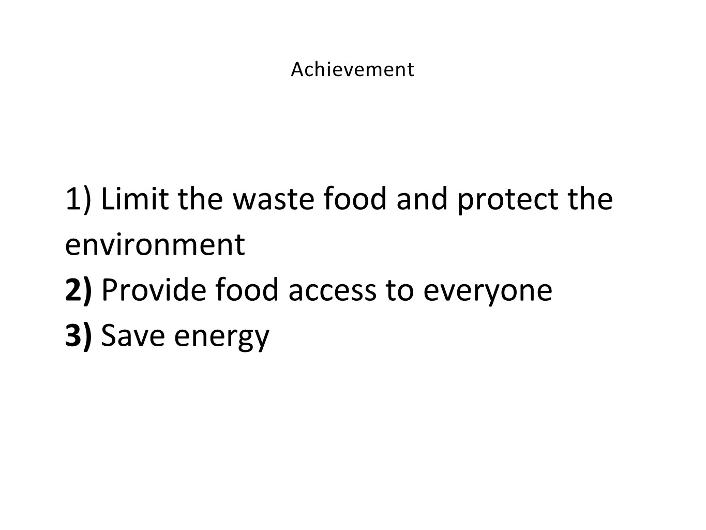

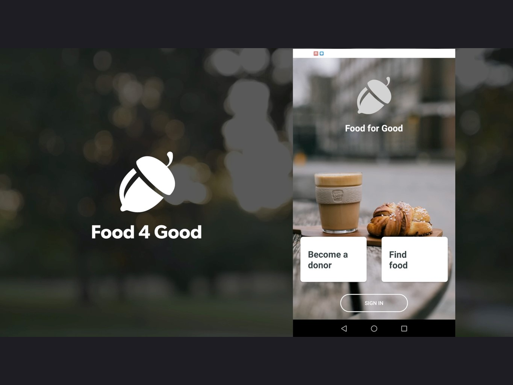
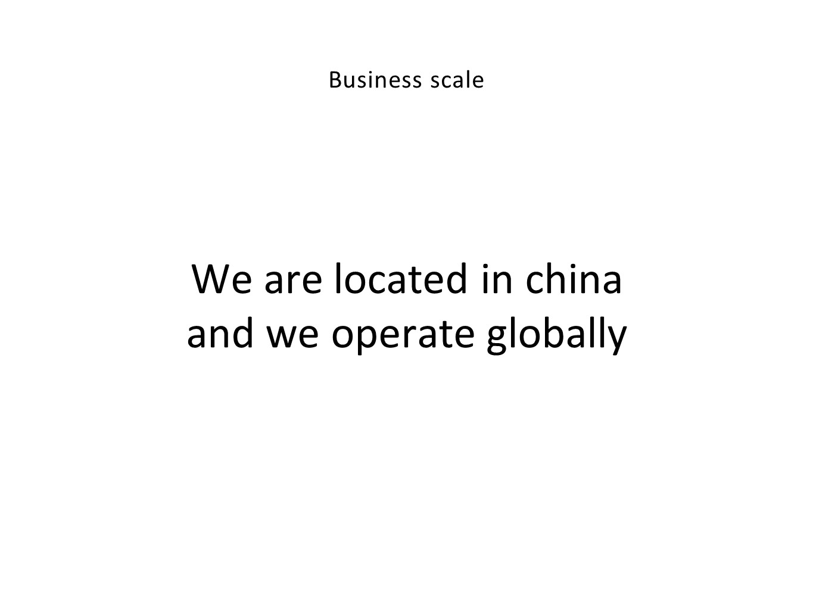
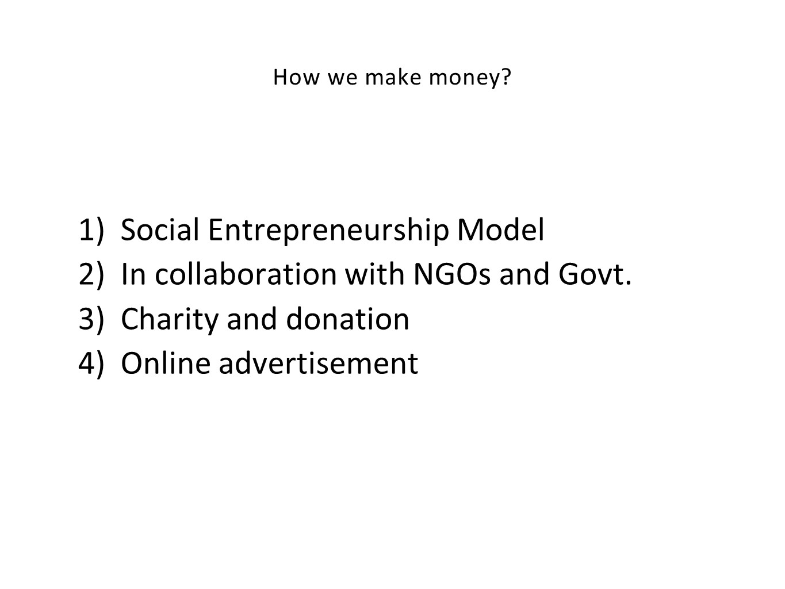
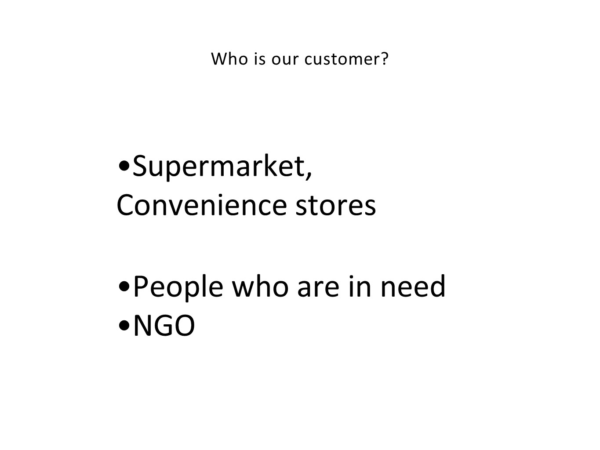
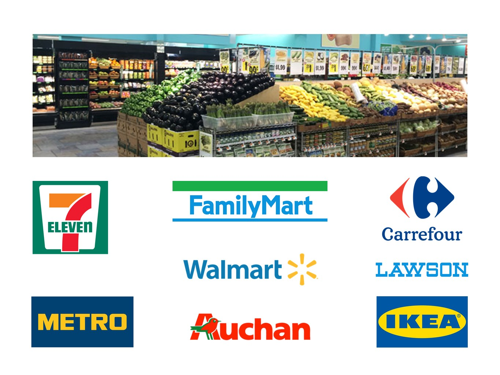

